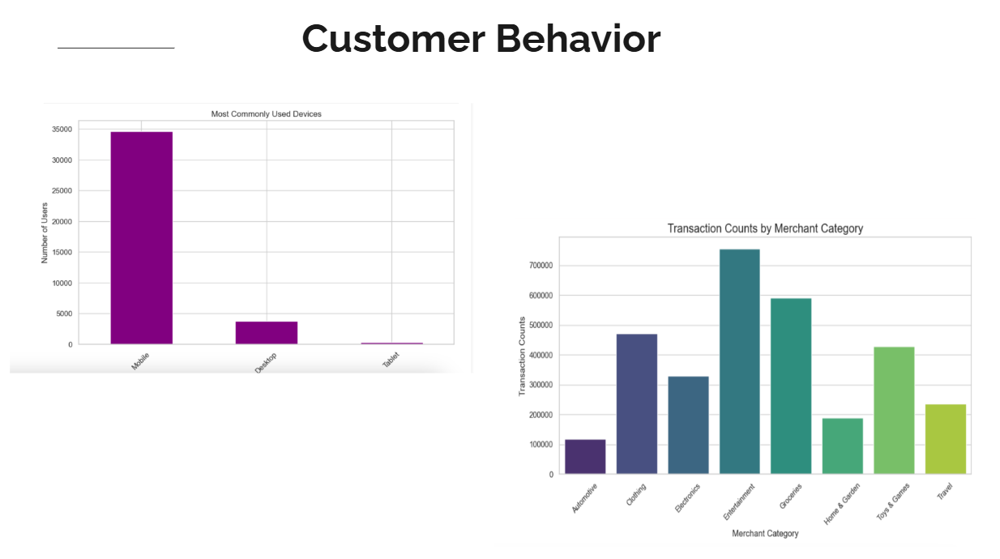

# E-Commerce Customer Segmentation

## Description
This project aims to perform customer segmentation for e-commerce companies by analyzing transaction data and customer behaviors. By leveraging unsupervised machine learning (ML) techniques, we will cluster customers based on purchasing patterns, demographic information, and behavioral metrics. This segmentation will provide insights into customer groups, enabling personalized marketing, enhanced user experiences, and improved customer retention strategies. The project will include visualizations to explore customers.

## Table of Contents
- [Installation](#installation)
- [Usage](#usage)
- [Credits](#credits)

- [Features](#features)

- [Contact](#contact)

## Installation
Technologies and Tools:
Programming Languages: Python
Libraries and Frameworks: Machine Learning: Scikit-learn, TensorFlow
Data Manipulation: Python Pandas, NumPy. Visualization: Matplotlib, Plotly, Seaborn

## Usage
Run ipybn files

## Credits
Juan Segovia, Julia McKinnon, Grant Ritzwoller, Daphine Nyangena, Ernesto Garcia 

## Features
Aggregated transaction features (Total Amount, Average Amount, Transaction Count) Time-based features (Recency, Preferred Hour of transactions) Behavioral features (Fraud Rate, Decline Rate, Unique Payment Methods) Location-based features (Latitude and Longitude clustering) Merchant category and transaction status features (Completed, Failed, Pending rates)

## Contact
If there are any questions or concerns, I can be reached at:
##### [github: JuanJSegovia, McKinnonJulia, ritzwoller1, McKinnonJulia, ritzwoller1, Rock-Roll1968)
##### [email: jseg0624@yahoo.com, juliamckinnon1234@gmail.com, ritzwoller@hotmail.com, daphinenyangena99@gmail.com, ernesto.v.garcia@outlook.com]